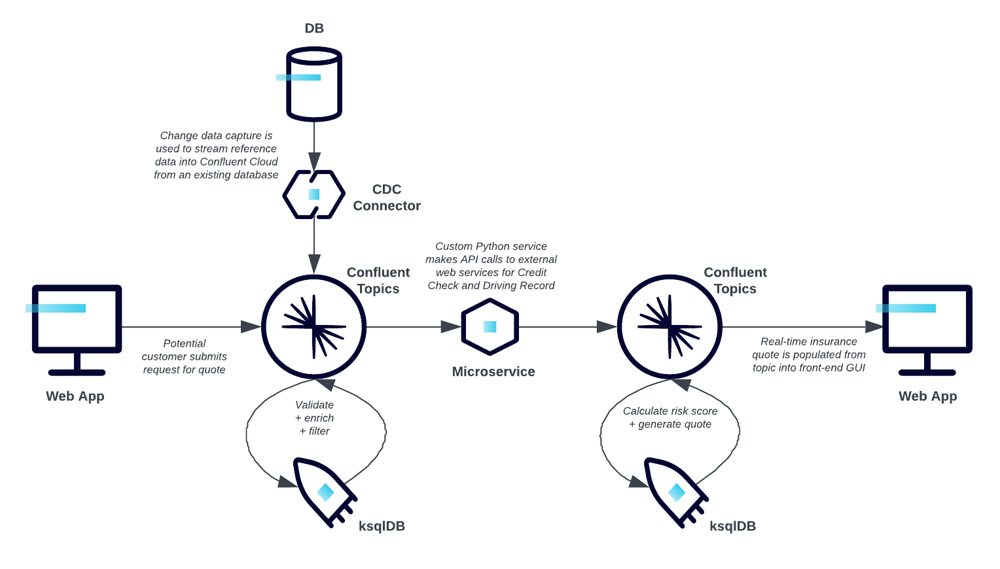
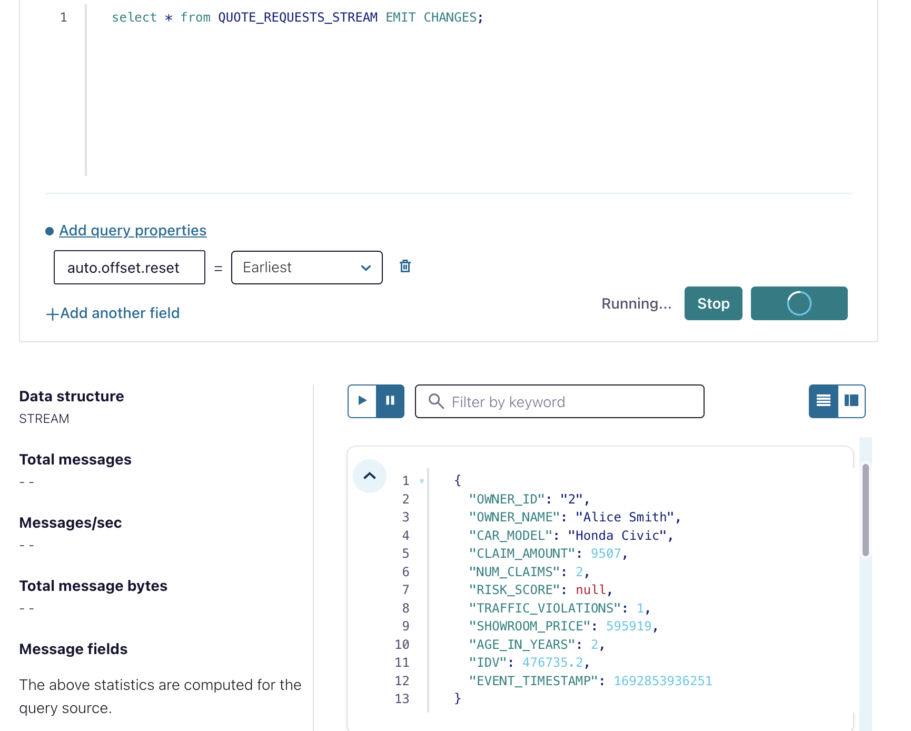
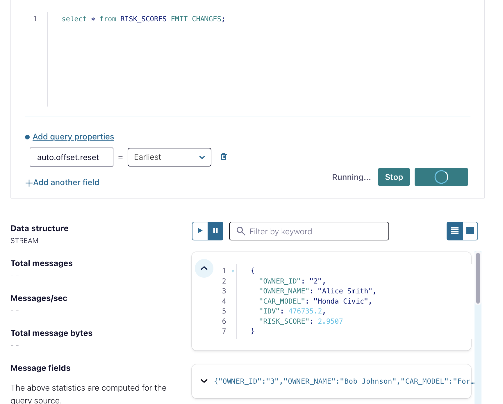
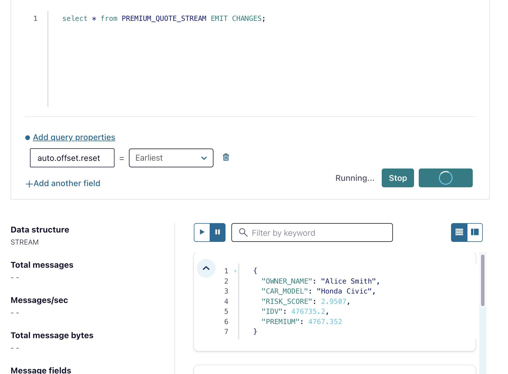
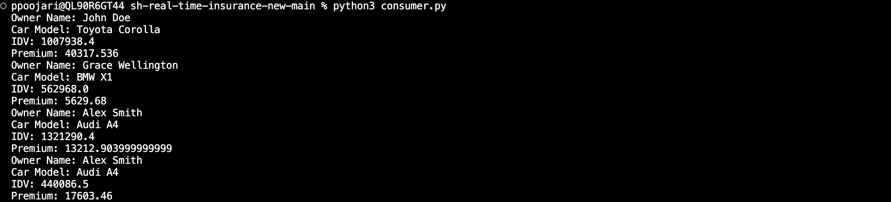

<div align="center" padding=25px>
    
</div>

# <div align="center">Real-time Insurance Quotes with Confluent Cloud</div>

Real-time insurance quotes refer to the process of obtaining insurance price estimates or premium costs instantly, often within seconds or minutes, based on the most up-to-date and accurate information provided by the applicant. These quotes are generated using algorithms and databases that take into account various factors to determine the potential risk associated with insuring an individual or property. The goal is to provide customers with immediate and accurate pricing information to help them make informed decisions about purchasing insurance coverage.


Real-time insurance quotes typically involve inputting specific details about the insured entity, such as personal information (age, gender, location), details about the property or vehicle being insured (make, model, year), and any other relevant information that could impact the risk assessment and subsequent premium calculation. This data is processed by the insurance company's systems, which use historical data, actuarial tables, and predictive modeling to generate a quote that reflects the potential cost of coverage.

This demo guides you through the process of getting vehicle insurance quotes in real-time .

## Architecture Diagram

This demo makes use of a Python data generator script to transmit the customer information events to Confluent Cloud. The events are then processed through KSQLDB, where they are aggregated to perform real-time calculations to provide the insurance quotes based on the risk score. We are using python consumer to consume the data which contains the Insurance premium value and IDV for each Cars w.r.t Owner

<div align="center"> 
  
</div>


# Requirements

In order to successfully complete this demo you need to install few tools before getting started.

- If you don't have a Confluent Cloud account, sign up for a free trial [here](https://www.confluent.io/confluent-cloud/tryfree).
- Install Confluent Cloud CLI by following the instructions [here](https://docs.confluent.io/confluent-cli/current/install.html).
- Please follow the instructions to install Terraform if it is not already installed on your system.[here](https://developer.hashicorp.com/terraform/tutorials/aws-get-started/install-cli)  
- This demo uses Python 3.9.13 version.
- This demo uses python modules. You can install this module through `pip`.
  ```
  pip3 install modulename
  ```

## Prerequisites

### Confluent Cloud

1. Sign up for a Confluent Cloud account [here](https://www.confluent.io/get-started/).
1. After verifying your email address, access Confluent Cloud sign-in by navigating [here](https://confluent.cloud).
1. When provided with the _username_ and _password_ prompts, fill in your credentials.

   > **Note:** If you're logging in for the first time you will see a wizard that will walk you through the some tutorials. Minimize this as you will walk through these steps in this guide.

1. Create Confluent Cloud API keys by following the steps in UI.Click on the button that is present on the right top section and click on Cloud API Key.
<div align="center"> 
  
</div>

 Now Click Add Key to generate API keys and store it as we will be using that key in this demo.
 <div align="center"> 
  
</div>
    
   > **Note:** This is different than Kafka cluster API keys.

## Setup

1. Clone the repository

```
git clone https://github.com/ppoojariconfluent/real-time-insurance.git

```
2. This demo uses Terraform  to spin up resources that are needed.

3. Update the `terraform/variables.tf` file for the following variables with your Cloud API credentials.

```
variable "confluent_cloud_api_key" {
  
  default = " Replace with your API Key created during pre-requsite"   
}

variable "confluent_cloud_api_secret" {
  default = "Replace with your API Key created during pre-requsite"   
}
```
 ### Build your cloud infrastructure

1. Navigate to the repo's terraform directory.
   ```bash
   cd terraform
   ```

2. Initialize Terraform within the directory.
   ```
   terraform init
   ```

3. Preview the actions Terraform would take to modify your infrastructure or Check if there are any errors in the code.
   ```
   terraform plan
   ```

4. Apply the plan to create the infrastructure.

   ```
   terraform apply 
   ```

   > **Note:** Read the `main.tf` configuration file [to see what will be created](./terraform/main.tf).


 # Demo
## Execute Python Script to Generate Mock Data

Please run the Python script located in the Python script folder. Before running it, make sure to replace the below mentioned  configuration settings in the code to point to your Confluent Cloud cluster that you created.
    
```
BOOTSTRAP_SERVERS = ''  # Replace with your Confluent Cloud bootstrap servers
SASL_USERNAME = ''  # Replace with your Confluent Cloud API key
SASL_PASSWORD = ''  # Replace with your Confluent Cloud API secret
```
To obtain the following details, navigate to the Clients section on the Confluent Cloud UI and select Python as the script type. From there, you can copy the bootstrap server and API Key details and replace them in the code.

<div align="center"> 
  
</div>

Please run the Python script using the following syntax:

```
python producer.py
```


## Data Streams with ksqlDB

Now that you have data flowing through Confluent, you can now easily build stream processing applications using ksqlDB. You are able to continuously transform, enrich, join, and aggregate your data using simple SQL syntax. You can gain value from your data directly from Confluent in real-time. Also, ksqlDB is a fully managed service within Confluent Cloud with a 99.9% uptime SLA. You can now focus on developing services and building your data pipeline while letting Confluent manage your resources for you.

<B>This section will involve the creation of a KStreams where we calculate the premium quotes depending on the risk score in real-time using simple SQL like commands.<B>

If you’re interested in learning more about ksqlDB and the differences between streams and tables, I recommend reading these two blogs [here](https://www.confluent.io/blog/kafka-streams-tables-part-3-event-processing-fundamentals/) and [here](https://www.confluent.io/blog/how-real-time-stream-processing-works-with-ksqldb/).

1. On the navigation menu click on **ksqlDB** and step into the cluster you created during setup.
   To write streaming queries against topics, you will need to register the topics with ksqlDB as a stream or table.

2. **VERY IMPORTANT** -- at the bottom of the editor, set `auto.offset.reset` to `earliest`, or enter the statement:

   ```SQL
   SET 'auto.offset.reset' = 'earliest';
   ```

   If you use the default value of `latest`, then ksqlDB will read form the tail of the topics rather than the beginning, which means streams and tables won't have all the data you think they should.

3. Create a ksqlDB stream from `quote_requests` topic.

 ```SQL
CREATE STREAM quote_requests_stream (
    OWNER_ID VARCHAR,
    OWNER_NAME VARCHAR,
    CAR_MODEL VARCHAR,
    CLAIM_AMOUNT DOUBLE,
    NUM_CLAIMS INT,
    TRAFFIC_VIOLATIONS INT,
    SHOWROOM_PRICE DOUBLE,
    AGE_IN_YEARS INT,
    IDV DOUBLE,
    EVENT_TIMESTAMP BIGINT
) WITH (
    KAFKA_TOPIC='quote_requests',
    VALUE_FORMAT='JSON',
    TIMESTAMP='EVENT_TIMESTAMP'
);
 ```
**EXPLANATION**

A stream represents a series of messages flowing in from an input topic which has been deserialized from bytes and has a schema applied to it so the data can be processed in ksqlDB. The initial quote_requests_stream is being created directly based off the data in the quote_requests topic. As a user, you have the ability to define additional downstream streams in ksqlDB that filter, transform, aggregate and enrich the data.

4. Use the following statement to query `quote_requests_stream ` stream to ensure it's being populated correctly.

   ```SQL
   SELECT * FROM quote_requests_stream EMIT CHANGES;
   ```

   Stop the running query by clicking on **Stop**.

   <div align="center"> 
  
</div>

5. Create `risk_scores` stream which will calculate risk based on the previous claim amount and number of traffice violations .

 ```SQL
CREATE STREAM risk_scores WITH ( 
    KAFKA_TOPIC='risk_scores', 
    PARTITIONS=6
    ) AS
SELECT qr.owner_id, 
       qr.owner_name, 
       qr.car_model, 
       qr.idv,
           GREATEST(LEAST(5.0, 1 + qr.traffic_violations + (qr.claim_amount / 10000)), 0.0) AS risk_score
FROM quote_requests_stream qr;

```
**EXPLANATION OF THE RISK SCORE CALCULATION**

1 + traffic_violations + (claim_amount / 10000): Here, we're adding 1 to the sum of traffic_violations and the normalized claim amount. This is done to ensure that even if there are no traffic violations and no claims, the risk score is at least 1.
LEAST(5.0, ..): This function ensures that the calculated value doesn't exceed 5.0. 
GREATEST(.., 0.0): Finally, this function ensures that the calculated value doesn't go below 0.0. Negative risk scores don't make sense, so we clamp the value to a minimum of 0.0.
It ensures that the risk score is at least 1.0, not greater than 5.0, and not negative. 
This calculated risk score is then included in the new risk_scores stream along with the owner_id and car_model from the original quote_requests_stream.

6. Use the following statement to query `risk_scores` stream to ensure it's being populated correctly.

   ```SQL
   SELECT * FROM risk_scores EMIT CHANGES;
   ```

   Stop the running query by clicking on **Stop**.
<div align="center"> 
  
</div>


7. Create `premium_quotes_stream` stream which will calculate the final premium quote a customer has to pay depending on the risk score calcualted from the risk_scores stream .

 ```SQL
CREATE STREAM premium_quotes_stream WITH (
    KAFKA_TOPIC='premium_quotes',
    PARTITIONS=6
) AS
SELECT OWNER_NAME,
       CAR_MODEL,
       RISK_SCORE,
       IDV,
       CASE
           WHEN RISK_SCORE >= 4 THEN IDV * 0.04
           WHEN RISK_SCORE = 3 THEN IDV * 0.03
           WHEN RISK_SCORE = 2 THEN IDV * 0.02
           WHEN RISK_SCORE = 1 THEN IDV * 0.01
           ELSE IDV * 0.01
       END AS PREMIUM
FROM risk_scores;

```

8. Use the following statement to query `premium_quotes_stream` stream to ensure it's being populated correctly.

   ```SQL
   SELECT * FROM premium_quotes_stream EMIT CHANGES;
   ```

   Stop the running query by clicking on **Stop**.
<div align="center"> 
  
</div>

## Consume the Insurance quotes event to get the Insurance premium value for each owner

```py
python3 consumer.py
```
<div align="center"> 
  
</div>

# Teardown

You want to delete any resources that were created during the demo so you don't incur additional charges.


## Infrastructure

1. Run the following command to delete all resources created by Terraform
   ```bash
   terraform destroy

## Confluent Cloud Stream Governance

Confluent offers data governance tools such as Stream Quality, Stream Catalog, and Stream Lineage in a package called Stream Governance. These features ensure your data is high quality, observable and discoverable. Learn more about **Stream Governance** [here](https://www.confluent.io/product/stream-governance/) and refer to the [docs](https://docs.confluent.io/cloud/current/stream-governance/overview.html) page for detailed information.

1.  Navigate to https://confluent.cloud
1.  Use the left hand-side menu and click on **Stream Lineage**.
    Stream lineage provides a graphical UI of the end to end flow of your data. Both from the a bird’s eye view and drill-down magnification for answering questions like:

    - Where did data come from?
    - Where is it going?
    - Where, when, and how was it transformed?

In our use case, the stream lineage appears as follows: we utilize a Python script to generate events that are sent to the demo_car topic. These events are then aggregated on the stream with the assistance of a Ksqldb , where the insurance premium is calculated.


<div align="center"> 
  
</div>
   


# References
1. Confluent Cloud cluster types [page](https://docs.confluent.io/cloud/current/clusters/cluster-types.html)
2. ksqlDB [page](https://www.confluent.io/product/ksqldb/) and [use cases](https://developer.confluent.io/tutorials/#explore-top-use-cases)
3. Stream Governance [page](https://www.confluent.io/product/stream-governance/) and [doc](https://docs.confluent.io/cloud/current/stream-governance/overview.html)
4. RBAC in Confluent Cloud [page](https://docs.confluent.io/cloud/current/access-management/access-control/rbac/overview.html)
5. Terraform provider for Confluent [page](https://registry.terraform.io/providers/confluentinc/confluent/latest/docs)

  
